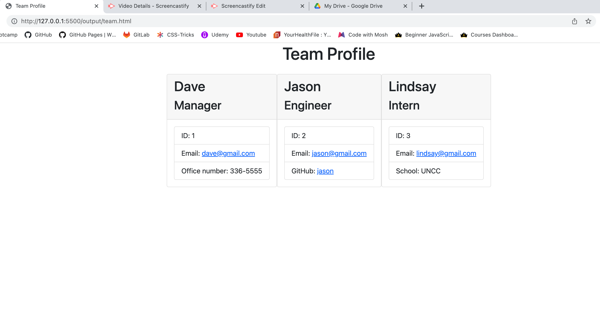
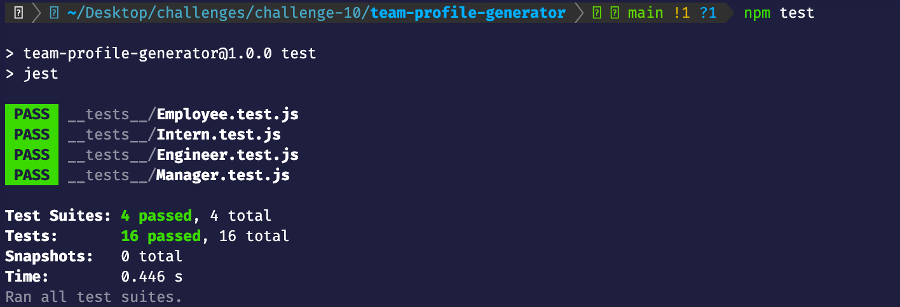

# Team Profile Generator

This is a software engineering team profile generator command line application. The application will prompt the user for information about the team members. The user can input any number of team members, and they may be a mix of managers, engineers, and interns. When the user has completed building the team, the application will create an HTML file that displays the team members.

A command-line application that dynamically generates a Team Profile from the user's input. The application will be invoked with the following command:

```
node index.js
```

## Team Profile Walkthrough Video

### [Video of the function of the Team Profile Generator](https://drive.google.com/file/d/1LtOvsAhqvdIN5Je7oQyuuQidVr_48C2e/view?usp=sharing)

### Languages and Tools:


</br></br>





## GitHub repository for challenge 10

-   [Github Repo](https://github.com/joliver521/Team-Profile-Generator)

## Live website for challenge 10

-   [Team Profile Generator](https://joliver521.github.io/Team-Profile-Generator/)
